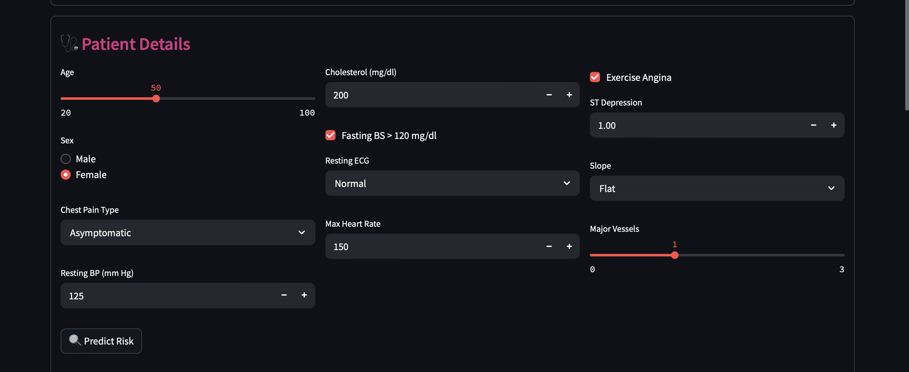
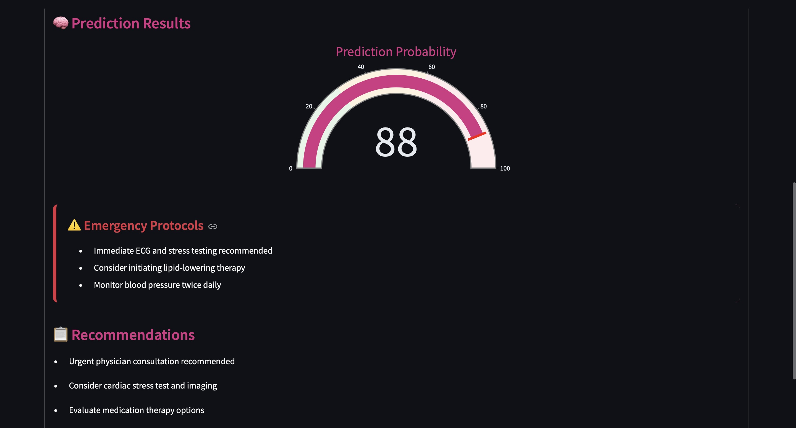

# 🫀 Cardio-Risk-Predictor: Heart Disease Prediction Model

## 📌 Overview

This project applies machine learning algorithms to predict the presence of heart disease in individuals using clinical and demographic data. The primary goal is to provide a reliable tool for early identification of at-risk patients, aiding clinical decision-making.

Dataset used: **[Heart Disease Dataset on Kaggle](https://www.kaggle.com/datasets/johnsmith88/heart-disease-dataset/data)**  
Includes features like age, sex, chest pain type, blood pressure, cholesterol levels, and ECG results.

---

## 🧾 Dataset Description

The dataset includes the following features:

- `age`: Age of the person  
- `sex`: Gender (1 = male, 0 = female)  
- `cp`: Chest pain type (categorical: 0–3)  
- `trestbps`: Resting blood pressure (mm Hg)  
- `chol`: Serum cholesterol (mg/dl)  
- `fbs`: Fasting blood sugar > 120 mg/dl (1 = true, 0 = false)  
- `restecg`: Resting ECG results (categorical)  
- `thalach`: Maximum heart rate achieved  
- `exang`: Exercise-induced angina (1 = yes, 0 = no)  
- `oldpeak`: ST depression induced by exercise  
- `slope`: Slope of peak ST segment (categorical)  
- `ca`: Number of major vessels colored by fluoroscopy  
- `thal`: Thalassemia (categorical)  
- `target`: 1 = heart disease, 0 = no heart disease  

---

## 🎯 Objective

To develop a machine learning model that predicts the presence of heart disease and deploy it via a web interface for use in clinical decision support.

---

## 🧠 Models & Approach

## Models Implemented

The following models have been implemented and evaluated:

1. **Logistic Regression** (Classification)
2. **Support Vector Machine (SVM)** (Classification)
3. **K-Nearest Neighbors (KNN)** (Classification)
4. **Random Forest Classifier** (Classification)
5. **Decision Tree Regressor** (Regression)
6. **Random Forest Regressor** (Regression)


### Model Used:
- Random Forest Classifier (primary)

### Workflow:
1. **Data Preprocessing**
   - Handle missing values
   - Encode categorical features
   - Train/test split (80/20)

2. **Model Training**
   - Test multiple algorithms
   - Optimize with GridSearchCV

3. **Evaluation Metrics**
   - Accuracy
   - Precision, Recall, F1-Score  
   - Learning Curve 

4. **Prediction**
   - Use the trained model to predict heart disease risk for new patients

---

## ✅ Results

The Random Forest model delivered the best overall performance and is saved for future inference and deployment in clinical applications.

---

## 🛠️ Installation Guide

### 1. Clone this Repository

```bash
git clone https://github.com/Ekuaappiah/cardio-risk-predictor.git
cd cardio-risk-predictor
```

### 2. Set Up a Virtual Environment

```bash
python3 -m venv venv
source venv/bin/activate      # macOS/Linux
venv\Scripts\activate         # Windows
```

### 3. Install Dependencies

```bash
pip install -r requirements.txt
```

### 4. Run the pipeline code for model

```bash
python heart_disease_pipeline.py
```

### 5. Run the App

```bash
streamlit run app.py
```

The application will launch at:  
[http://localhost:8501](http://localhost:8501)

---

## Containerizing the Heart Disease Predictor with Docker

This project can be containerized using Docker for easy deployment and execution. Follow the steps below to build and run the Docker container:

### Prerequisites
Make sure you have Docker installed on your machine. You can download and install Docker from [here](https://www.docker.com/get-started).

### Steps to Containerize

1. **Build the Docker Image**

   To build the Docker image for the project, navigate to the project directory and run the following command in the terminal:
   
   ```bash
   docker build -t heart-disease-predictor .
2. **Run the Docker Container**

   Once the image is built, you can run the container with the following command:
   
   ```bash
   docker run -it --rm heart-disease-predictor


## 💻 Usage

Visit the running Streamlit app to:
- Enter patient data
- View risk prediction results
- Understand model interpretation

---

## 🖼️ Screenshots
### HOW TO USE APP


### User Input Form


### Prediction Output  



## 🔧 Tech Stack

- **Languages/Libraries**: Python, pandas, numpy, scikit-learn, xgboost, matplotlib, seaborn  
- **Web App**: Streamlit  
- **Environment**: Jupyter Notebook, Pycharm  
- **Version Control**: Git & GitHub

---

## 👤 Author

**Emmanuella – Data Scientist**  
[LinkedIn](https://www.linkedin.com/in/emmanuella-appiah-16a215213) 

---

## 📜 License

This project is licensed under the [MIT License](LICENSE).

---
